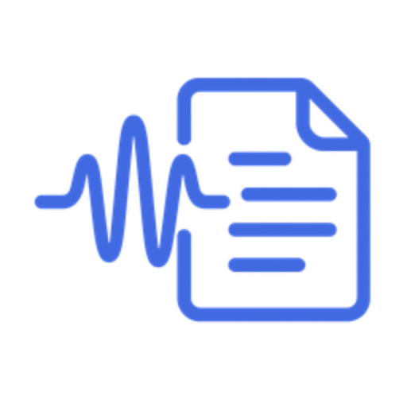

  <picture>
    <source media="(prefers-color-scheme: dark)" srcset="static/favicon/web-app-manifest-512x512.png" width="200">
    
  </picture>

<h1 align="center">Offline streaming transcription + one‑click AI notes</h1>

  <a href="docs/PRIVACY.md">🔒 Privacy Policy</a>&emsp;
  <a href="docs/SETUP.md">⚙️ Setup</a>&emsp;
  <a href="docs/CONTRIBUTING.md">🤝 Contribute</a>

  
  &nbsp;
  

## Lab12

A real‑time transcription dashboard: live mic audio → offline Vosk speech‑to‑text → GPT‑4o lecture notes → one‑click save to Google Drive.

---

## Features

- **Offline transcription** via Vosk
- **AI‑powered notes** (GPT‑4o)
- **Save to Google Drive** with one click

---

## How It Works

1. **Transcribe** your mic → WebSocket → Vosk → live transcript
2. **Generate** notes → OpenAI API → Markdown
3. **Save** to Drive → OAuth & Picker → Google Doc

_For full technical details and security info see [SETUP.md](docs/SETUP.md)._

---

## Future Roadmap

- Dark mode
- Robust testing & CI/CD
- Convert to a modern SPA frontend (React or Angular)

---

Dual‑licensed under [AGPL v3](https://www.gnu.org/licenses/agpl-3.0.html) OR Commercial. See [LICENSE](LICENSE.md) for details.
